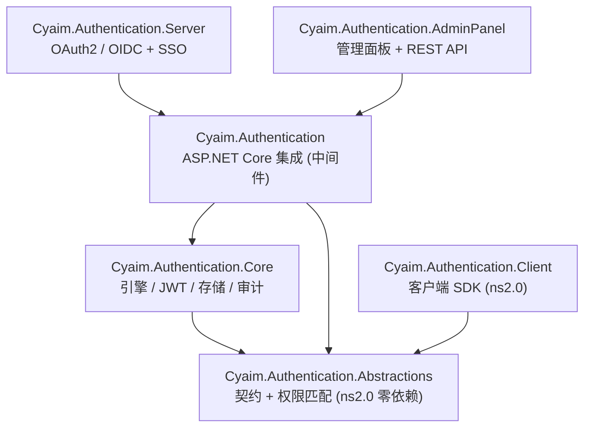
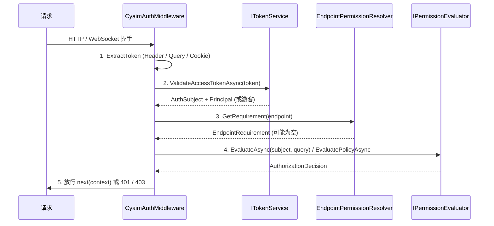

# 架构总览

> 一句话：Cyaim.Authentication 2.0 由六个可独立引用的包组成，核心是一个「令牌 → 主体 → 端点权限要求 → 评估器判断」的请求管线，可按需拼装成资源服务器或独立授权中心。

[文档中心](../README.md) / 概念

- 上一层概念：[权限模型](./permission-model.md)、[令牌与会话](./tokens-and-sessions.md)
- 相关参考：[配置项参考](../reference/configuration.md)、[权限代码语法](../reference/permission-codes.md)
- 上手：[快速上手](../getting-started.md)

## 六个包与职责

框架按「契约 / 引擎 / 宿主集成 / 授权中心 / 管理面板 / 客户端」分层，每一层只依赖更底层，便于按场景裁剪引用。

| 包 | 目标框架 | 职责 | 依赖 |
| --- | --- | --- | --- |
| `Cyaim.Authentication.Abstractions` | netstandard2.0（零第三方依赖） | 契约与纯算法：模型（`AuthUser`/`AuthRole`/`AuthSubject`/`ClientApplication`）、存储接口、服务接口、权限匹配（`PermissionCode`/`CompiledPermissionSet`/`PermissionTrie`）、特性（`RequirePermissionAttribute`/`AllowGuestAttribute`） | 无 |
| `Cyaim.Authentication.Core` | ns2.0 / net8 / net9 | 引擎实现：`PermissionEvaluator`、`JwtTokenService`、`RefreshTokenManager`、`Pbkdf2PasswordHasher`、`DefaultAuditLogger`、内存/JSON 文件存储、`AuthDataSeeder` | Abstractions |
| `Cyaim.Authentication` | ASP.NET Core | 宿主集成：`CyaimAuthMiddleware`、端点标注扩展、`HttpContext` 扩展、`[Authorize(Policy="cyaim:...")]` 桥接、端点权限扫描 | Abstractions、Core |
| `Cyaim.Authentication.Server` | ASP.NET Core | OAuth 2.0 / OIDC 端点与 SSO 会话（`SsoSessionService`） | Abstractions、Core、Cyaim.Authentication |
| `Cyaim.Authentication.AdminPanel` | ASP.NET Core | 权限管理面板与 REST 管理 API | Abstractions、Core、Cyaim.Authentication |
| `Cyaim.Authentication.Client` | netstandard2.0（纯托管） | 客户端 SDK：`CyaimAuthClient`、令牌缓存、PKCE、`HttpClient` 处理器；可用于 WPF/WinForms/控制台/Blazor WASM | Abstractions |

### 依赖关系图



要点：

- **Abstractions 零依赖**，可被资源服务器、桌面客户端、甚至独立的策略库共享，且能离线做权限匹配。
- **Core 不引用 ASP.NET Core**，纯 .NET 引擎；因此评估器、令牌服务可脱离 Web 宿主单测与复用。
- **Server 与 AdminPanel 平级**，都建立在 ASP.NET Core 集成之上，可单独启用或组合启用。
- **Client 只依赖 Abstractions**，不引入服务端引擎，体积小，可在 WASM 沙箱运行。

## 一次请求如何被鉴权

请求进入 `app.UseCyaimAuthentication()` 注册的 `CyaimAuthMiddleware` 后，走五个阶段（源码见 `src/Cyaim.Authentication/AspNetCore/CyaimAuthMiddleware.cs` 的 `InvokeAsync`）：



1. **令牌提取** `ExtractToken`：依次尝试 `Authorization` 头（`Bearer ` 前缀，也接受裸令牌）、`?access_token=`（受 `AllowTokenFromQuery` 控制，WebSocket 握手常用）、Cookie（受 `AllowTokenFromCookie` 控制）。请求头名、查询参数名、Cookie 名均可配置。
2. **解析主体**：无令牌时构造游客主体 `AuthSubject.Guest(options.GuestRoles)`，`TokenState.None`；有令牌时调用 `ITokenService.ValidateAccessTokenAsync` 校验签名/有效期/签发者/受众，成功得到 `AuthSubject` 并写入 `HttpContext.User`，状态 `TokenState.Valid`；校验失败回退游客，状态 `TokenState.Invalid`。主体与状态存入 `ICyaimAuthFeature`，供 `HttpContext.GetAuthSubject()`/`GetTokenState()` 读取。
3. **端点权限要求**：`EndpointPermissionResolver.GetRequirement` 读取当前端点的 `RequirePermissionAttribute`/`AllowGuestAttribute` 元数据，解析为 `EndpointRequirement`。要求为空或标记 `AllowAnonymous` 时直接放行。
4. **评估器判断**：
   - 未认证但端点有要求时，先评估（游客角色也可能持权限）——命中则放行，否则返回 401（无令牌为 `Bearer`，无效令牌带 `WWW-Authenticate: Bearer error="invalid_token"`，对齐 RFC 6750 §3）。
   - 已认证时逐条评估 `EndpointRequirement.Rules`：单条规则内多权限码按「任一（默认）/ 全部（`RequireAll`）」，含 ABAC 策略时调用 `EvaluatePolicyAsync`；任一条规则不满足即以 `AuthorizationDecision` 返回 403。
   - 仅要求「已认证」（无具体权限码）的端点会额外调用 `IsSubjectActiveAsync`，确认账户未禁用/锁定、令牌安全戳仍一致（详见[令牌与会话](./tokens-and-sessions.md#安全戳失效机制)）。
5. **放行或拒绝**：通过则 `await _next(context)`；拒绝走 `DenyAsync`——写审计（受 `AuditDenials` 控制）、可选回调 `OnDenied`，否则输出 JSON `{ error, error_description, permission }`。

> WebSocket 握手同样经过该中间件，鉴权在握手前完成；连接建立后可在消息循环里用 `HttpContext.HasPermissionAsync(code)` 做细粒度判断。参见 [WebSocket 鉴权](../guides/websocket.md)。

评估器热路径（缓存命中）是纯同步 `O(1)`/`O(段数)` 查找，权限判断细节见[权限模型](./permission-model.md)。

## 两种部署形态

同一套包按需拼装出两种形态，二者可以是同一个进程，也可以拆成多个进程。

### 资源服务器（只保护 API）

只引用 `Cyaim.Authentication`，令牌由外部授权中心签发，本服务只校验并鉴权：

```csharp
var builder = WebApplication.CreateBuilder(args);

builder.Services.AddCyaimAuthentication(o =>
{
    o.Issuer = "https://auth.example.com";   // 与授权中心一致
    o.Audience = "orders-api";
    o.HmacSigningKey = "至少32字节的共享签名密钥..........";  // 或用 RSA/JWKS
}).AddInMemoryStore();

var app = builder.Build();
app.UseCyaimAuthentication();
app.MapGet("/api/orders", () => "...").RequirePermission("sales.order.read");
app.Run();
```

本地未注册用户/角色存储时，评估器回退到令牌自带的 `perm`/`role` 声明（`PermissionEvaluator.BuildEntryAsync` 中「本地无此用户」分支），适合无状态资源服务。详见 [保护 ASP.NET Core API](../guides/protect-aspnetcore.md)。

### 授权中心（签发令牌 + SSO + 管理）

在集成之上叠加 Server 与 AdminPanel，成为统一登录与令牌签发方：

```csharp
builder.Services.AddCyaimAuthentication(o =>
{
    o.Issuer = "https://auth.example.com";
    o.Audience = "my-api";
}).AddJsonFileStore("auth-data.json");

builder.Services.AddCyaimAuthServer(o => { });      // OAuth2/OIDC 端点 + SSO 会话
builder.Services.AddCyaimAuthAdminPanel(o => { });  // /auth-admin 管理面板

var app = builder.Build();
app.UseCyaimAuthentication();
app.MapCyaimAuthServer();   // /.well-known/*、/connect/*、/account/*
app.MapCyaimAuthAdmin();    // /auth-admin 与 {BasePath}/api
app.Run();
```

组装顺序固定为：`AddCyaimAuthentication(...)`（链式 `AddInMemoryStore()`/`AddJsonFileStore(path)`/`MapStore<T>()`/`AddPolicy(...)`）→ `AddCyaimAuthServer(...)` → `AddCyaimAuthAdminPanel(...)`，随后 `UseCyaimAuthentication()` → `MapCyaimAuthServer()` → `MapCyaimAuthAdmin()`。详见 [搭建授权中心与统一登录](../guides/auth-server-sso.md)、[使用权限管理面板](../guides/admin-panel.md)。

各业务应用把 `Issuer`/`Audience`/签名密钥指向该中心即可共享登录（授权码 + PKCE 经 `/connect/authorize`，共享 SSO 会话 Cookie）。服务端端点清单见 [OAuth2/OIDC 端点参考](../reference/server-endpoints.md)。

## 扩展点一览

框架的每个可替换职责都是 Abstractions 中的接口，默认实现用 `TryAddSingleton` 注册——你只要在 `AddCyaimAuthentication` 之前注册自己的实现即可覆盖默认。

| 接口 | 默认实现 | 作用 | 替换方式 |
| --- | --- | --- | --- |
| 六个存储接口（`IUserStore`、`IRoleStore`、`IClientStore`、`IPermissionDefinitionStore`、`ITokenStore`、`IAuthStoreVersion`） | `InMemoryAuthStore` / `JsonFileAuthStore` | 用户、角色、客户端、权限定义、令牌记录的持久化，以及版本戳 | 实现全部六个接口的类，`.MapStore<TStore>()`（**单例**注册） |
| `IPermissionEvaluator` | `PermissionEvaluator` | 编译并缓存主体有效权限、做出判断 | `services.AddSingleton<IPermissionEvaluator, MyEvaluator>()` |
| `ITokenService` | `JwtTokenService` | 签发/校验 JWT、导出 JWKS | 同上 |
| `IPasswordHasher` | `Pbkdf2PasswordHasher` | 口令哈希与校验 | 同上 |
| `IAuditLogger` | `DefaultAuditLogger` | 审计事件落地 | 同上 |
| `IAuthClock` | `SystemAuthClock` | 统一时钟（便于测试、时钟偏移） | 同上 |
| `IAuthPolicy` | 无（按需注册） | 命名 ABAC 策略 | `.AddPolicy(name, ctx => ...)` 或 `.AddPolicy<TPolicy>()` |

> `MapStore<TStore>` 以**单例**注册存储。若用 EF Core / `DbContext` 实现，存储内部必须用 `IDbContextFactory<T>` 或 `IServiceScopeFactory` 自建作用域，**不能**直接持有 Scoped 的 `DbContext`。详见 [自定义存储（EF/数据库）](../guides/custom-stores.md)。

ABAC 策略的编写见 [自定义 ABAC 策略](../guides/custom-policies.md)；判断原因与错误码见 [判断原因与错误码参考](../reference/decisions-and-errors.md)。

## 相关文档

- [权限模型](./permission-model.md) —— 权限代码、RBAC、ABAC、有效权限编译与缓存
- [令牌与会话](./tokens-and-sessions.md) —— JWT、刷新令牌、SSO 会话、安全戳、口令哈希
- [配置项参考](../reference/configuration.md) —— 全部配置类与默认值
- [公开 API 参考](../reference/api.md)
- [保护 ASP.NET Core API](../guides/protect-aspnetcore.md) / [搭建授权中心与统一登录](../guides/auth-server-sso.md)
- [生产部署清单](../guides/production-checklist.md)
